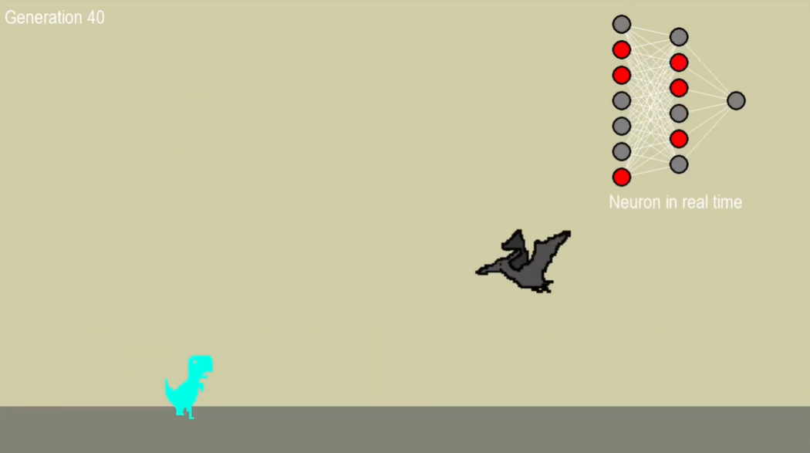
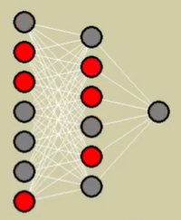

<h1>Machine Learning plays the Dinosaur Game</h1>
<h2>Introduction</h2>

In this project, I recreated the Google game(Dinosaur Game), for my Machine Learning, with the goal of learning
about Data Science and the theories of Machine Learning/Neural Networks. It's a very simple project made by me, studying
with the objective of entering in the world of programming in a an in-depth way.

<h2>Explaning about the project</h2>

The project is simple, but with simple visual, clear information, ponctuation graph and the functioning of neurons.

It's separated in 7 modules: Ambient, Main structure, Objetcs, Player inputs, Machine Learning, Graphic and the images(Dinosaur Images).

<h3>Ambient</h3>

This module is simple, It sets the scene and visualizes neuron in action.

Link: 
<a href = "https://github.com/Gui-coder-alpha/MACHINE-LEARNING/blob/main/Dinosaur_game_ML/Ambient.py">Ambient.py</a>

<h3>Main Structure</h3>

The principal module, ensures the project functions smoothly by integrating all the modules within itself and running efficiently.

Here we have the scenario, the player's characteristcs, collisions, a matplotlip graph, objects like thorns and finally the neural network itself coming into action.

Link: 
<a href = "https://github.com/Gui-coder-alpha/MACHINE-LEARNING/blob/main/Dinosaur_game_ML/Main_structure.py">Main_strucure.py</a>

<h3>Objects</h3>

This part refers to the objetcs, the spikes, defeat collisions, ramdomness and finally the sprites of the objects.

Link: 
<a href = "https://github.com/Gui-coder-alpha/MACHINE-LEARNING/blob/main/Dinosaur_game_ML/Objects.py">Objects.py</a>

<h3>Player Inputs</h3>

This module is the player, the controls(jumps), hurtboxes, speed, colors and animation. Here, we have the actions
for the Machine Learning so that it can play.

Link: 
<a href = "https://github.com/Gui-coder-alpha/MACHINE-LEARNING/blob/main/Dinosaur_game_ML/Player_inputs.py">Player_inputs.py</a>

<h3>Machine Learning</h3>

The brain, the neurons, the main attraction, the network. This is where the magic happens, where the neural network learns to play the game, presenting a total of 7 inputs, 6 hidden layers, and 1 output. The Machine Learning receives the distance and height of objects and itself. Using the activation function via the sigmoid function and forward function, the network undergoes mutations based on its total score.

Link: 
<a href = "https://github.com/Gui-coder-alpha/MACHINE-LEARNING/blob/main/Dinosaur_game_ML/MachineLearning.py">MachineLearning.py</a>

<h3>Graphic</h3>

Bascially, the graphy of the score according to generation, giving us the information on how well it perfomed in a determined generation.

Link: 
<a href = "https://github.com/Gui-coder-alpha/MACHINE-LEARNING/blob/main/Dinosaur_game_ML/Graphic.py">Graphic.py</a>

<h3>Images</h3>

A set of images.

Link: 
<a href = "https://github.com/Gui-coder-alpha/MACHINE-LEARNING/blob/main/Dinosaur_game_ML/Dinosaur_Images">Dinosaur_Images.py</a>